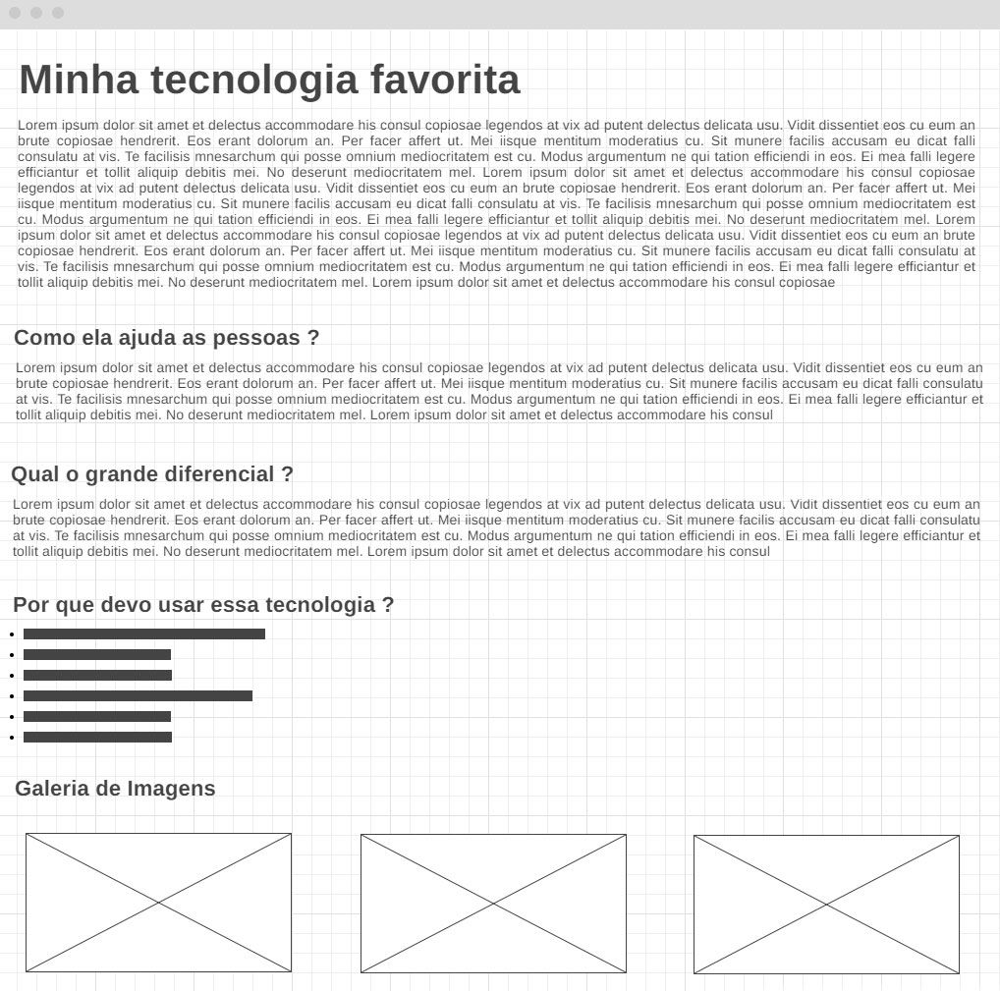

# Aula 1 - Conhecendo HTML

> Instalação Editor e Extensões
> Introdução HTML e Estrutura
> Títulos. Parágrafos
> Introdução CSS - Tipos de Seletores e Formatações
> Google Fonts

<details><summary>Editor</summary>

<br>

# Baixando o Editor

Instalando e configurando o VSCode

https://code.visualstudio.com/download

<details><summary>Extensões e Atalhos</summary>

<br>

## Extensões

- Beautify
- Live Server
- Material Icon Theme
- Path Intellisense
- Auto Rename Tag
- Bracket Pair Colorizer 2

## Atalhos

| Atalho                             | Funções                                                        |
| :--------------------------------- | :------------------------------------------------------------- |
| Ctrl + +                           | Aumentar zoom                                                  |
| Ctrl + -                           | Diminuir zoom                                                  |
| Ctrl + ,                           | Abrir painel de configurações                                  |
| Ctrl + Alt + setas para cima/baixo | Insere múltiplos cursores                                      |
| Alt + Click                        | Indentação automática                                          |
| Alt + Shift + F                    | Indentação automática                                          |
| Alt + setas                        | Move a linha ou bloco de código onde o cursor está posicionado |
| Ctrl + K + C                       | Comentar a linha                                               |
| Ctrl + ;                           | Comentar a linha                                               |
| Alt + Shift + setas                | Duplicar linha                                                 |
| Ctrl + Barra de espaço             | Abre o intellisense                                            |
| Ctrl + ]                           | Dividir a tela                                                 |
| Ctrl + K + S                       | Exibe todos os atalhos                                         |

</details>

</details>

<br>

# Introdução HTML

> HTML - HyperText Markup Language

<details><summary>Estrutura HTML</summary>

```html
<!DOCTYPE html>
<html lang="pt-br">
  <head>
    <meta charset="UTF-8" />
    <meta name="viewport" content="width=devide-width, initial-scale=1.0" />
    <title>Document</title>
  </head>
  <body></body>
</html>
```

## \<!DOCTYPE html\>

Será a primeira linha do código.
Indica ao browser qual especificação do HTML estará na página.

## \<html lang="pt-br"\>

Indica o início do código.
Todos os elementos existentes na página são alocados abaixo dessa tag.

Deve-se informar o idioma principal do documento por meio do atributo **lang**.
Neste caso **pt-br** indica que o conteúdo da página estará em língua portuguesa.

No final do documento é possível encontrar o fechamento da tag representado por **\</html\>** indicando a finalização da página.

## \<head\>

Uma das seções mais importantes do código.
Seu conteúdo é o primeiro a ser lido no carregamento da página.

Nela pode-se definir estilos, links, títulos do documento e até metadados (dados gerados sobre a própria página).

O fechamento dessa tag é representado por **\</head\>**

## \<meta charset="UTF-8"\>

Essa metatag sempre ficará na seção **\<head\>**.
Metatags não possuem fechamento.

Indica qual a cadeia de caracteres o documento utilizará.

O idioma pt-br possui letras com acentuação, por isso **utf-8** é a cadeia de caracteres a ser utilizada.
Desta forma o navegador exibirá as palavras acentuadas de forma correta.

## \<meta name="viewport" content="width=device-width, initial-scale=1.0"\>

Essa metatag sempre ficará na seção **\<head\>**.
Metatags não possuem fechamento.

Importante para design responsivo.

O navegador detecta o tamanho exato da área disponível para exibição de conteúdo no dispositivo onde o acesso será realizado: notebook, tablet, smartphone etc.

## \<title\>

Também presente na seção **\<head\>**, define o título da página.

Importante: não deixar essa tag vazia, pois os robôs de pesquisa do **Google** lêem o seu conteúdo e entendem que ali está uma descrição que pode indicar o assunto principal da página.

Possui fechamento representado por **\</title\>**

## \<body\>

Seção onde o conteúdo da página é inserido.
O conteúdo pode ser: texto, imagem, vídeo, tabela ou qualquer outro tipo de elemento.

Possui fechamento representado por **\</body\>**

</details>

<details><summary>Criando o Projeto</summary>

<br>

## Estrutura de Pastas

```ps
FRONT/
  assets/
    css/
    images/
    js/
  index.html
```

## index.html

```html
<!-- Recurso **Emmet Abreviation** permite escrever código de maneira rápida
     '! + Enter' monta a estrutura HTML -->

<!DOCTYPE html>
<html lang="en">
  <head>
    <meta charset="UTF-8" />
    <meta http-equiv="X-UA-Compatible" content="IE=edge" />
    <meta name="viewport" content="width=device-width, initial-scale=1.0" />
    <title>Document</title>
  </head>
  <body></body>
</html>
```

## Títulos e Parágrafos

### Títulos (Cabeçalhos)

As tags **\<h1\>**, **\<h2\>**, **\<h3\>**, **\<h4\>**, **\<h5\>** e **\<h6\>** são os cabeçalhos para os documentos HTML.

São usados como títulos para os conteúdos da página.

O elemento **\<h1\>** é o maior nível de cabeçalho enquanto o elemento **\<h6\>** é o menor.

```html
<h1>Cabeçalho nível 1</h1>
<h2>Cabeçalho nível 2</h2>
<h3>Cabeçalho nível 3</h3>
<h4>Cabeçalho nível 4</h4>
<h5>Cabeçalho nível 5</h5>
<h6>Cabeçalho nível 6</h6>
```

### Parágrafos

A tag **\<p\>** permite a criação de um parágrafo.
Pode-se usar **CSS** para fazer a estilização desse parágrafo formatando, entre outras coisas, suas margens, fonte, cor, largura etc.

```html
<p>Aqui vem o texto...</p>
```

#### Lorem Ipsum

Pode ser gerada uma simulação de texto com o uso do **Emmet Abreviation** no VSCode.

Para isso, basta digitar a palavra **lorem** e pressionar a tecla **ENTER**.

```html
<p>
  Lorem ipsum dolor sit amet consectetur adipisicing elit. Reprehenderit culpa
  cumque temporibus, cum dolores ad, cupiditate, veniam consequatur nisi harum
  illum iusto! In expedita aspernatur asperiores veniam perspiciatis repellendus
  dolorum.
</p>
```

Também é possível definir a quantidade de palavras.

Digitar a palavra **lorem50** e pressionar a tecla **ENTER** para escrever 50 palavras.

</details>

<br>

# Introdução CSS

CSS - Cascading Style Sheets

Linguagem de estilos utilizada para formatar documentos feitos em HTML.
Permite que propriedades sejam aplicadas às tags de uma página permitindo assim a estilização de seu conteúdo.
A CSS definirá a aparência e o layout da sua página HTML.

<details><summary>Tipos de Declaração</summary>

<br>

| Tipos | Descrição   | Observações                                                             |
| :---: | :---------- | :---------------------------------------------------------------------- |
|  IL   | CSS INLINE  | As regras de formação são inseridas diretamente na tag.                 |
|  IN   | CSS INTERNO | As regras de formatação são inseridas no <head> da página.              |
|  EX   | CSS EXTERNO | As regras de formatação são inseridas em um documento separado do HTML. |

> CSS INLINE

Consiste na inserção de código CSS dentro da tag do elemento HTML que desejamos formatar.
Isso é possível por meio da utilização do atributo **style**

_A utilização de CSS inline não é uma boa prática._

```html
<h2 style="color: red;">Mobile</h2>
<h3 style="color: red;">Web</h3>
<h4 style="color: red;">Games</h4>
```

> CSS INTERNO

Caracterizado pela criação das regras dentro da seção \<head\> da página.
Para que o navegador entenda a formatação da página seção \<head\>, é preciso colocar as regras CSS dentro da tag \<style\>.

Ela é melhor que a CSS inline, mas também possui algumas restrições que podem indisponibilizar seu uso.

```html
<style type="text/css">
  h1 {
    color: blue;
  }
  h2 {
    color: black;
  }
  p {
    color: brown;
  }
</style>
```

> CSS EXTERNO

Caracterizado pela criação das regras dentro de um arquivo separado do código HTML.
Esse arquivo é chamado de **folha de estilos**

Esse arquivo deverá ser saldo com o nome desejado, seguido da extensão **\*.css**

Para que as páginas possam usar a formatação que será desenvolvida em um arquivo separado, deve-se fazer um link do HTML com o CSS.
Isso deve ocorrer na seção <head> com o uso da tag <link>

```html
<link rel="stylesheet" href="css/style.css" />
```

</details>

<details><summary>Efeito Cascata</summary>

<br>

> Efeito de especificidade

O efeito cascata define qual regra será aplicada quando existir mais de um estilo para o mesmo elemento HTML.
Ele seguirá o seguinte padrão:

1. Regra de estilo padrão do navegador;
2. Regra CSS externa
3. Regra CSS interna
4. Regra CSS inline

</details>

<details><summary>Declaração de uma regra CSS</summary>

<br>

Uma regra CSS é um conjunto de declarações que definirão como será o estilo de um ou mais elementos HTML.
Um conjunto de regras CSS forma uma **Folha de Estilos**.
É composta por um **seletor**, uma **propriedade** e um **valor**

```css
seletor {
  propriedade: valor;
}
```

|  Elementos  | Descrição                                        |
| :---------: | :----------------------------------------------- |
|   Seletor   | Elemento HTML que deseja-se formatar             |
| Propriedade | Aquilo que deseja-se formatar no seletor         |
|    Valor    | Novo valor que a propriedade do seletor receberá |

</details>

<details><summary>Agrupando seletores CSS</summary>

<br>

É possível agrupar vários seletores para que todos recebam a mesma regra CSS.
Para isso, basta digitar os seletores separando-os por vírgula.
A regra declarada será aplicada a todos eles.

```css
h1,
h2,
h3,
h4,
h5,
h6 {
  color: #99000;
}
```

</details>

<details><summary>Seletores de ID - Class</summary>

<br>

Para utilizar estilos específicos para uma tag, ou grupo de tags, podemos criar seletores de dois tipo: **Seletor de ID** e **Seletor de Class**.

> Seletor de ID

Todo elemento HTML pode receber o atributo ID, ele servirá como um identificador para o elemento e pode ser usado pela CSS.
Em uma página HTML não podemos ter IDs repetidos.

```css
#meuID {
  propriedade: valor;
}
```

> Seletor de Class

Pode-se usar o atributo CLASS em qualquer elemento HTML e usá-lo na regra CSS.
Em uma página HTML, podemos ter CLASS repetidas

```css
.minha_class {
  propriedade: valor;
}
```

</details>

<details><summary>Formatação Font-Family</summary>

<br>

Define as fontes que serão usadas na página.
É comum declararmos mais de uma fonte, pois caso o navegador não encontre a primeira fonte, ele tentará a prósima fonte, e assim por diante.
Caso nenhuma fonte declarada seja encontrada, ele usará o padrão do seu navegador.

```css
p {
  font-family: verdana, calibri, tahoma;
}
```

</details>

<details><summary>Formatação Font-Size</summary>

<br>

Define o tamanho da fonte do seletor

```cs
p{
    font-size:20px;
}
```

</details>

<details><summary>Formatação Color</summary>

<br>

Define a cor da fonte que será usada em nossos textos.
A declaração das cores aceita os seguintes tipos de valores:

**Nome da fonte em inglês**: red - blue - white - black
**Código hexadecimal**: #000000, #996633, #cc3366
**Código RGB**: rgb(0,0,0), rgb(10,200,160)

```css
p {
  color: red;
}

h2 {
  color: #336699;
}

h3 {
  color: rgb(255, 255, 255);
}
```

</details>

<details><summary>Formatação Font-Weight</summary>

<br>

Define o peso da fonte do seletor.
Os valores numéricos aceitos variam entre 100 e 900, com intervalos de 100 em 100.
Também podemos fazer a declaração usando palavras-chave: normal, bold, bolder, lighter.

```css
p {
  font-weight: 900;
}
```

</details>

<details><summary>Formatação Text-Align</summary>

<br>

Define o alinhamento de nossos textos.
Possui os seguintes valores: left, right, center, justify

```css
p {
  text-align: center;
}
```

</details>

<details><summary>Formatação Text-Decoration</summary>

<br>

Define a decoração do texto, uma linha que poderá ficar acima, abaixo ou no meio do texto.
Os valores válidos são: overline, underline, line-through
Os links são os elementos, que por padrão, possuem essa propriedade com valor inicial underline

```css
p {
  text-decoration: overline;
}
```

</details>

<details><summary>Formatação Text-Transform</summary>

<br>

Define letras maiúsculas e minúsculas em um texto.
Os valores válidos são: lowercase, uppercase, capitalize

```css
p {
  text-transform: uppercase;
}
```

</details>

<details><summary>Formatação Line-Height</summary>

<br>

Define a altura da linha.
Pode ser usada para alterar a distância entre as linhas do texto.

```css
p {
  line-height: 25px;
}
```

</details>

<br>

# Google Fontes

## Selecionando famílias de fontes

https://fonts.google.com

> Select this style:
> @import

<br>

# Hands On

Wireframe são protótipos básicos que demonstram como ficará o layout de uma página ou site. A ideia é que ele demonstre de forma clara e objetivo como as informações serão exibidas no navegador. Existem muitos aplicativos que executam essa tarefa, dê uma olhadinha na página de **Referências Front-End** e clique no item **Mockups**.

Baseando-se no wireframe abaixo, montar uma página HTML que apresente alguma tecnologia atual que você é apaixonado.

<details><summary>Wireframe</summary>



</details>

<br>
